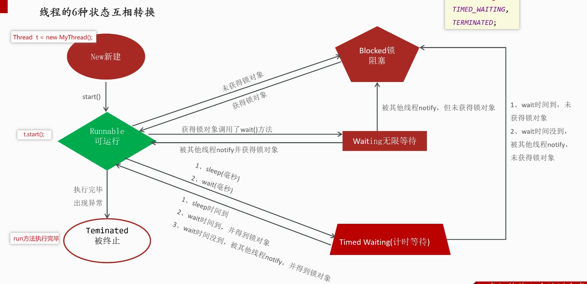

## 概述

> - 进程
>   - 正在运行的程序就是一个独立的进程
> - 线程（Thread）
>   - 程序执行的基本单位，一个程序内部的一条执行流程
>   - 并发
>     - 多个线程宏观同时，微观轮流
>     - 时间片
>   - 并行
>     - 多个线程在同一时刻执行
>     - 多核
> - 多线程
>   - 指在同一个进程中并发执行多个线程，每个线程执行一个任务


## 线程创建

> - 启动线程必须调用父类的start（）方法，调用子类的run方法不会创建线程
> - 不要把主线程任务放在子线程任务之前
>   - 顺序执行，脱裤子放屁


### 方式一：继承Thread类

#### 流程

> - 继承Thread
> - 重写run方法

#### 优缺点

> - 优点
>   - 代码简单
> - 缺点
>   - 单继承，不方便拓展

```java
class MyThread extends Thread {
    
    @Override
    public void run() {
        System.out.println("Thread is running.");
    }
}

public class Main {
    public static void main(String[] args) {
        MyThread thread = new MyThread();
        thread.start();  // 启动线程
    }
}
```


### 方式二：实现Runnable接口

####　流程

> - 创建类实现Runnable接口，重写run
> - 创建Runnable实现类，当前任务对象
> - 创建Thread对象，传入任务对象
> - 调用start（）方法

#### 优缺点

> - 优点
>   - Java不支持多继承，使用Runnable接口可让类继承其他类的同时实现多线程
>   - 更加灵活
> - 缺点：
>   - 无法获取执行结果

```java
lass MyRunnable implements Runnable {
    @Override
    public void run() {
        System.out.println("Runnable is running.");
    }
}

public class Main {
    public static void main(String[] args) {
        Thread thread = new Thread(new MyRunnable());
        thread.start();  // 启动线程
    }
}
```


### 方式三：实现Callable< T > 接口

#### 特点

> - 前两者都有一个问题，无法获取执行结果且抛出异常
> - Callable可以返回一个结果，且能够抛出异常
> - 使用  Callable  通常配合  Future  或  FutureTask 来获取线程执行的结果

#### 原理

> - 在多线程编程中，Callable 接口和 FutureTask 的组合提供了一种处理异步任务的机制
> - FutureTask 封装了 Callable，允许将其作为 Runnable 提交到一个线程或线程池中去执行。
>   - Callable 接口定义了一个 call() 方法，该方法允许返回一个泛型类型的结果
>   - **FutureTask 是 Runnable 的一个实现，可以被提交给 Thread 来执行**
> - 通过 FutureTask，可以在任务执行结束后获取结果，甚至可以在任务执行的过程中取消任务。
>   - get() 方法

#### 流程

> - 创建任务对象
>   - 创建一个类实现Callable< T >接口
>   - 重写call方法，封装要做的事和要返回的数据
>   - call( ) 方法类似于run( )方法
> - 封装  -- （ 在包装一层 ）
>   - 把 Callable类型的对象 封装成 FutureTask 类型对象
>   - 任务对象
> - 借助Thread对象启动线程
>   - 调用star启动线程 
>   - Start（FutureTask对象）
> - 通过FutureTask获取返回值

#### Callable任务的完整形式

```java
Callable<Integer> callableTask = new Callable<Integer>() {
    @Override
    public Integer call() throws Exception {
        System.out.println("Task is running...");
        return 42;  // 返回结果
    }
};
```

#### Callable任务的lambda表达式形式

```java
Callable<Integer> callableTask = () -> {
    System.out.println("Task is running...");
    return 42;  // 返回结果
};
```

```java
public class Main {
    public static void main(String[] args) {
        
        // 创建 Callable 任务
        Callable<Integer> callableTask = () -> {
            System.out.println("Callable task is running...");
            return 42;  // 返回值
        };

        // 使用 FutureTask 包装 Callable
        FutureTask<Integer> futureTask = new FutureTask<>(callableTask);

        // 创建线程并启动
        Thread thread = new Thread(futureTask);
        thread.start();

        try {
            // 获取线程执行的结果
            Integer result = futureTask.get();
            System.out.println("Result from callable: " + result);
        } catch (InterruptedException | ExecutionException e) {
            e.printStackTrace();
        }
    }
}
```


## 线程的生命周期




## 线程冲突

### 概述

> - 多个线程     同时修改  一个共享资源

### 解决办法 -- 线程同步

> - 强制有序，一个操作必须在另一个操作完成后开始执行
>   - 在多线程环境中，通过同步机制（上锁）确保某些  **关键部分**  在同一时间只被一个线程执行。
>   - 虽然这些关键部分是顺序执行的，但其他线程可以并行执行不同的部分。
> -  在 Java 语言中，每一个对象有一把锁，都会有一个monitor属性
> - 线程可以使用 synchronized 关键字来获取对象上的锁

### synchronized

> - 用于控制对共享资源的访问，每次只允许一个线程加锁，加锁后才能进入访问，访问完自动解锁
> - 建议使用共享资源加锁，随便加锁会影响其它线程执行
>   - 实例：this
>   - 静态：类文件
> - 可以修饰方法或代码块

```java
 // 同步方法
    public synchronized void increment() {
        
    }
```


```java
//同步代码块
    synchronized (lockObject) {

    }
```

### 自动上锁

> - 通常指的是使用 `synchronized` 关键字来实现的锁定机制。
> - 如果是实例，默认是this
> - 如果是静态，默认是字节码

### 手动上锁

> - 通常指使用 `Lock` 接口及其实现类（如 `ReentrantLock`）来进行显式的锁定。在这种机制中，开发者需要手动管理锁的获取和释放。
> - ReentrantLock  是 Lock 接口的一个实现，提供了可重入的锁，允许同一线程多次获得锁而不会导致死锁

```java
public class ManualLockExample {
    
    //获得锁对象
    private final Lock lock = new ReentrantLock();

    public void method() {
        
        // 手动上锁
        lock.lock(); 
        try {
            
            // 需要同步的代码
        } finally {
            
            // zaifinally中确保释放锁
            lock.unlock(); 
        }
    }
}
```

### 手动与自动对比

> - synchronized 锁  **在同一线程尝试再次获取锁时会导致该线程被阻塞**
> - 自动锁中，当一个线程已经持有某个锁时，它可以再次获得该锁，而不会被阻塞或产生死锁。

```java
public class ReentrantLockExample {
    private final Lock lock = new ReentrantLock();

    // 外部方法
    public void outerMethod() {
        lock.lock(); // 获取锁
        try {
            System.out.println("In outerMethod");
            innerMethod(); // 调用内部方法
        } finally {
            lock.unlock(); // 释放锁
        }
    }

    // 内部方法
    public void innerMethod() {
        lock.lock(); // 再次获取锁
        try {
            System.out.println("In innerMethod");
        } finally {
            lock.unlock(); // 释放锁
        }
    }

    public static void main(String[] args) {
        ReentrantLockExample example = new ReentrantLockExample();
        example.outerMethod();
    }
}
```


## 死锁

### 概述

> - 两个或多个线程在执行过程中，因争夺资源而造成一种  **相互等待**  的状态，从而导致它们无法继续执行

### 四个基本条件

> - **互斥条件**：至少有一个资源必须被一个线程持有，并且此资源在被另一个线程请求时不能被共享。
> - **占有并等待**：一个线程至少持有一个资源，并且正在等待获取其他被其他线程持有的资源。
> - **不剥夺条件**：资源不能被强制从一个线程中剥夺，只有线程主动释放资源。
> - **循环等待**：存在一种线程的循环等待状态，其中每个线程都在等待下一个线程所持有的资源。

### 代码示例

```java
public class DeadlockExample {

    static class Resource {
        private final String name;

        public Resource(String name) {
            this.name = name;
        }

        public String getName() {
            return name;
        }
    }

    private static final Resource resource1 = new Resource("Resource 1");
    private static final Resource resource2 = new Resource("Resource 2");

    public static void main(String[] args) {
        Thread thread1 = new Thread(() -> {
            synchronized (resource1) {
                System.out.println("Thread 1: Holding resource 1...");
                try {
                    Thread.sleep(100); // Simulate some work
                } catch (InterruptedException e) {
                    e.printStackTrace();
                }
                System.out.println("Thread 1: Waiting for resource 2...");
                synchronized (resource2) {
                    System.out.println("Thread 1: Acquired resource 2!");
                }
            }
        });

        Thread thread2 = new Thread(() -> {
            synchronized (resource2) {
                System.out.println("Thread 2: Holding resource 2...");
                try {
                    Thread.sleep(100); // Simulate some work
                } catch (InterruptedException e) {
                    e.printStackTrace();
                }
                System.out.println("Thread 2: Waiting for resource 1...");
                synchronized (resource1) {
                    System.out.println("Thread 2: Acquired resource 1!");
                }
            }
        });

        thread1.start();
        thread2.start();
    }
}
```

> - **资源定义**：
>   - `Resource` 类表示一个共享资源。我们创建了两个资源 `resource1` 和 `resource2`。
> - **线程1**：
>   - 获取 `resource1` 的锁，然后模拟一些工作（通过 `Thread.sleep(100)`）。
>   - 接着，它试图获取 `resource2` 的锁。
> - **线程2**：
>   - 获取 `resource2` 的锁，然后模拟一些工作。
>   - 接着，它试图获取 `resource1` 的锁。


## 死锁解决 -- 线程通信

### 概述

> - 线程通信的核心是多个线程之间通过某种机制（例如锁、信号量、队列）来共享资源或协调执行顺序，以保证数据一致性、避免资源竞争。
> - 无论是资源有序分配法、避免互斥占有，还是超时释放法，都是在不同程度上  **通过某种资源调度机制来协调线程的行为，从而避免资源竞争导致的死锁问题**

### 种类

> - **资源有序分配**
>   - 设定一个固定的资源获取顺序来避免死锁
>   - 本质上是通过有序的资源请求实现线程之间的  **隐式通信**，保证资源的获取和释放是协调的。
> - **超时释放**
>   - **设定超时时间**，当一个线程长时间无法获取资源时，它会放弃请求并释放已经占有的资源
>   - 通过线程的等待时间进行的一种  **间接通信**，通过超时机制让线程之间在资源请求上达成某种协调
> - **避免占有并等待**
>   - 确保线程在获取资源时不会长时间占用资源，而是及时释放
>   - 典型的例子就是使用像 `BlockingQueue` 这样的阻塞队列，当一个线程请求资源而资源不可用时，它会等待其他线程释放资源后再继续执行。
>   - 这种机制是线程之间的一种  **显式通信**，即线程之间通过资源的可用性进行协同。


## 生产/消费者模型

### 模型概述

> - 生产者
>   - 生产数据，往共享缓冲区中添加数据，生产完让自己等待并通知消费者
> - 消费者
>   - 从共享缓冲区中取走数据并进行处理（消费），消费完让自己等待，通知生产者
> - 缓冲区
>   - 用于存放生产者生产的资源，当缓冲区满时，生产者需要等待；当缓冲区为空时，消费者需要等待

### 作用

> - 生产者可能比消费者快，或消费者比生产者快。生产者-消费者模型通过缓冲区来适配这种速度不一致的问题
> - 型中的线程通过同步和通信来协调资源的获取与释放，减少资源争用和死锁的风险。


### **基于同步方法的生产者消费者模式**

> - 使用Java的对象锁机制来实现同步
>   - `wait()`用于线程等待
>   - `notify()`用于唤醒等待线程。

#### Buffer类

```java
public class Buffer {

    private final Queue<Integer> queue = new LinkedList<>();
    private final int capacity;

    public Buffer(int capacity) throws InterruptedException {
        this.capacity = capacity;
    }

    // 生产方法
    public synchronized void produce(int value) throws InterruptedException {

        // 如果缓冲区已满，等待消费者消费
        while (queue.size() == capacity) {
            wait();
        }
        queue.add(value);
        System.out.println("Produced: " + value);

        // 唤醒消费者
        notifyAll();
    }

    // 消费方法
    public synchronized int consume() throws InterruptedException {

        // 如果缓冲区为空，等待生产者生产
        while (queue.isEmpty()) {
            wait();
        }

        // 从队列中 获取并移除 队列头部的元素。
        // 如果队列为空，它会返回 null，而不会抛出异常。
        int value = queue.poll();
        System.out.println("Consumed: " + value);

        // 唤醒生产者
        notifyAll();
        return value;
    }
}

```


> - 这是一个共享缓冲区类，生产者和消费者都会访问它。
> - 它使用了一个`LinkedList`来模拟一个有容量限制的缓冲区，最大容量为5
> - 该类中包含两个主要方法
>   - produce(int value) 用于生产数据，
>   - consume( ) 用于消费数据。
>   - 两者都用`synchronized`关键字修饰，保证了对缓冲区的操作是线程安全的。

##### produce( int value )

> - 这个方法由生产者线程调用，它会将数据添加到缓冲区中。
> - 如果缓冲区已满（`list.size() == capacity`），生产者线程会调用`wait()`进入等待状态，直到消费者消费了数据并调用`notify()`唤醒它。
> - 一旦有空位，生产者将`value`添加到`list`中，并调用`notify()`通知消费者线程可以开始消费了。

##### consume()

> - 这个方法由消费者线程调用，它会从缓冲区中取出数据进行消费。
> - 如果缓冲区为空（`list.isEmpty()`），消费者线程会调用`wait()`进入等待状态，直到生产者生产数据并调用`notify()`唤醒它。
> - 一旦缓冲区中有数据，消费者将`list`中的第一个元素取出，消费后调用`notify()`通知生产者线程可以继续生产数据。


#### ProducerConsumerTest类

> - 负责启动生产者和消费者线程

```java
public class ProducerConsumerExample {
    public static void main(String[] args) throws InterruptedException {
        Buffer buffer = new Buffer(5);  // 缓冲区容量为5

        Producer producer = new Producer(buffer);
        Consumer consumer = new Consumer(buffer);

        producer.start();
        consumer.start();
    }
}

```


#### Consumer类

> - 继承Thread

```java
public class Consumer extends Thread {
    private final Buffer buffer;

    public Consumer(Buffer buffer) {
        this.buffer = buffer;
    }

    @Override
    public void run() {
        /* 死循环,1000ms延迟 */
        while (true) {
            try {
                /*消费*/
                buffer.consume();
                Thread.sleep(1000);  // 模拟消费延迟
            } catch (InterruptedException e) {
                e.printStackTrace();
            }
        }
    }
}
```


#### Producer类

> - 继承Thread

```java
public class Producer extends Thread {
    private final Buffer buffer;

    public Producer(Buffer buffer) {
        this.buffer = buffer;
    }

    @Override
    public void run() {
        int value = 0;

        /* 死循环,500ms延迟 */
        while (true) {
            try {
                //生产
                buffer.produce(value++);
                Thread.sleep(500);  // 模拟生产延迟
            } catch (InterruptedException e) {
                e.printStackTrace();
            }
        }
    }
}
```


#### 使用 **BlockingQueue**（JDK提供的阻塞队列解决方案）


## 改进的低耦合模型

### 概述

> - **Buffer 只负责资源的管理**：
>   - `Buffer` 类不再包含生产和消费的逻辑，而只负责管理共享的缓冲区资源（如 `LinkedList`）。它可以提供简单的 `add()` 和 `remove()` 方法，用于在共享资源上进行基本操作。
> - **生产者和消费者类**：
>   - 分别创建 `Producer` 和 `Consumer` 类，它们各自负责生产和消费的具体逻辑。生产者调用 `Buffer` 的 `add()` 方法将数据加入缓冲区，消费者调用 `Buffer` 的 `remove()` 方法从缓冲区获取数据。
> - **灵活的扩展性**：
>   - 你可以通过继承 `Producer` 或 `Consumer` 类，重写生产或消费逻辑，而不需要修改 `Buffer` 类的代码。例如，可以创建不同的生产者类来处理不同类型的数据，或者为消费者提供不同的处理方式。

### 选用Runnable而不是Thread的原因

> - **Runnable**：
>   - 它是一个功能接口，只定义了一个 `run()` 方法，用于封装具体的任务逻辑。
>   - 在使用  Runnable  时，任务逻辑和线程控制是分离的，线程执行逻辑通过 `Thread` 类来管理，而任务逻辑由 `Runnable` 实现。
> - **Thread**：
>   - Thread  也是一个可运行的类，且可以通过继承来执行任务，但它不仅包含了任务逻辑，还负责线程的生命周期管理。
>   - 如果直接继承 `Thread` 类，任务逻辑和线程管理就耦合在一起了，违反了单一职责原则。

### 具体实现

```java
// 共享资源类 Buffer
class Buffer {
    private LinkedList<Integer> list = new LinkedList<>();
    private int capacity = 5;  // 缓冲区大小

    public synchronized void add(int value) throws InterruptedException {
        while (list.size() == capacity) {
            System.out.println("Buffer is full. Producer is waiting...");
            wait();
        }
        list.add(value);
        System.out.println("Produced: " + value);
        notifyAll();  // 唤醒所有等待的线程
    }

    public synchronized int remove() throws InterruptedException {
        while (list.isEmpty()) {
            System.out.println("Buffer is empty. Consumer is waiting...");
            wait();
        }
        int value = list.removeFirst();
        System.out.println("Consumed: " + value);
        notifyAll();  // 唤醒所有等待的线程
        return value;
    }
}

// 生产者类
class Producer implements Runnable {
    private Buffer buffer;

    public Producer(Buffer buffer) {
        this.buffer = buffer;
    }

    @Override
    public void run() {
        int value = 0;
        try {
            while (true) {
                buffer.add(value++);
                Thread.sleep(500);  // 模拟生产的延迟
            }
        } catch (InterruptedException e) {
            Thread.currentThread().interrupt();
        }
    }
}

// 消费者类
class Consumer implements Runnable {
    private Buffer buffer;

    public Consumer(Buffer buffer) {
        this.buffer = buffer;
    }

    @Override
    public void run() {
        try {
            while (true) {
                buffer.remove();
                Thread.sleep(1000);  // 模拟消费的延迟
            }
        } catch (InterruptedException e) {
            Thread.currentThread().interrupt();
        }
    }
}

public class ProducerConsumerTest {
    public static void main(String[] args) {
        Buffer buffer = new Buffer();

        Thread producerThread = new Thread(new Producer(buffer));
        Thread consumerThread = new Thread(new Consumer(buffer));

        producerThread.start();
        consumerThread.start();
    }
}
```


## 上下文开销

### 概述

> - 上下文开销主要是指在使用锁机制时，由于线程的同步与互斥操作，产生的额外性能消耗。
> - 虽然锁能够确保线程安全，但也会导致线程在等待、竞争或管理锁资源时发生额外的系统开销。
> - 当一个线程获取不到锁时，会被阻塞，操作系统可能会将该线程置于等待状态并调度其他线程执行。

### 上下文切换

> - 线程上下文切换非常耗时，因为它不仅仅涉及用户空间的操作，还会涉及操作系统内核空间的调用和内核调度。
> - 这种开销包括时间和资源的消耗，因此频繁的上下文切换会导致系统性能下降。

> - 线程的上下文切换是指操作系统从一个线程切换到另一个线程所需要保存和恢复 CPU 状态的过程。
> - 每次上下文切换会涉及：
>   - **保存当前线程的状态**：包括寄存器、堆栈指针等。
>   - **恢复目标线程的状态**：从内存中恢复寄存器和程序计数器等信息。

### 锁的获取和唤醒

> - 在竞争激烈的情况下，获取锁和释放锁的操作可能需要大量的 CPU 资源

> - 获取和释放锁本身也是有成本的。当一个线程尝试获取锁时，操作系统或者 JVM 需要做以下工作：
>   - **检查锁的状态**：判断锁是否已经被其他线程占用。
>   - **锁竞争处理**：如果有多个线程同时尝试获取同一把锁，操作系统或 JVM 需要处理这些竞争，决定哪个线程优先获取锁。

### 阻塞和唤醒

> - 当线程无法获取到锁时，它会被置于阻塞状态，直到锁被释放后才能再次尝试获取。
> - 线程阻塞和唤醒的操作会导致系统调度的额外开销，  **过多的锁竞争**  可能导致线程频繁的阻塞和唤醒，从而降低程序的性能。

> - **阻塞**：当一个线程进入阻塞状态时，操作系统需要将其挂起，保存状态，并调度其他线程运行。
>
>   **唤醒**：当锁被释放时，等待该锁的线程需要被唤醒，操作系统又需要重新调度这些线程，这个过程同样会涉及到线程的上下文切换。

### 锁的粒度

> - 锁的粒度是指锁保护资源的大小或范围。锁的粒度越大，锁保护的资源越多，被锁定的代码段越大，竞争锁的线程越多，锁的上下文开销也就越大。
>   - **粗粒度锁**：
>     - 比如类锁（静态方法锁）或锁定大范围的代码块，会导致更多的线程竞争同一把锁，可能产生较多的上下文切换、等待和唤醒操作。
>   - **细粒度锁**：
>     - 细粒度锁锁定较小的资源或代码块，可以减少竞争，但增加了开发的复杂性，需要更小心地设计锁定的区域，避免死锁。

### 死锁检测

> - 为了避免死锁，系统可能需要跟踪锁的获取和释放情况，特别是在复杂的并发应用中。
> - 虽然 JVM 或操作系统不一定总会主动检测死锁，但某些系统提供的死锁检测机制会增加锁操作的开销，尤其是在调试或调优环境下。

### 内存不一致

> - 在多线程环境下，每个线程有自己的缓存，线程对共享数据的修改需要确保在所有线程中的内存视图一致。
> - 锁机制确保了**内存可见性**，即当一个线程持有锁并修改共享变量时，其他线程通过锁的同步机制能够看到最新的修改。
> - 这意味着在获取和释放锁时，系统可能会强制执行  **内存屏障（Memory Barrier）**，确保修改的可见性。
> - 这种强制的缓存同步操作也会产生一定的性能开销。

### 总结

> - 在设计并发程序时，需要尽量减少锁的使用或选择更轻量级的同步机制，比如采用细粒度锁、无锁编程（如 `Atomic` 类）、乐观锁等来降低锁的上下文开销。


