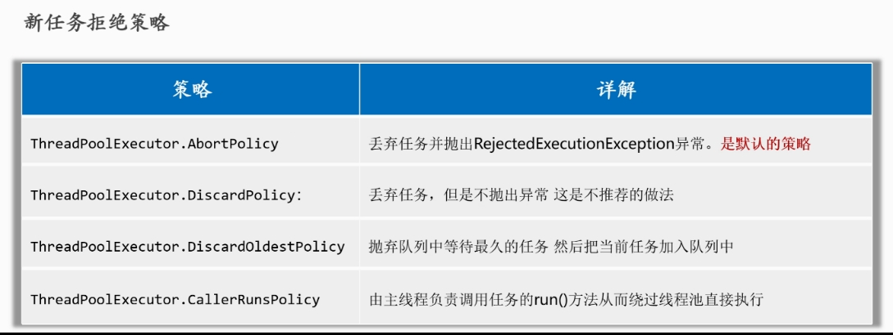

## 起源与目的

### 减少线程创建与销毁的开销

> - **线程创建与销毁的高开销**：
>   - 在不使用线程池的环境下，每个任务都可能需要创建一个新线程。
>   - 线程的创建涉及系统资源分配（如栈内存、内核对象等），而线程的销毁同样需要释放这些资源。
>   - 这些操作代价高昂，尤其在大量并发任务中会严重影响系统性能。
> - **线程池复用线程**：
>   - 线程池通过复用已经存在的线程来执行新的任务，避免了频繁的创建和销毁开销。
>   - 特别是对于短时间、频繁的任务，线程池能极大减少资源浪费。

### 更高效的资源利用

> - **控制并发数量**：
>   - 如果不使用线程池，在高并发场景下可能会产生过多的线程，导致系统资源（如 CPU、内存）被耗尽，从而影响系统的稳定性和性能。
>   - 线程池允许开发者通过配置  **核心线程数**  和  **最大线程数**，来限制并发线程的数量，避免系统资源过载。
> - **任务队列**：
>   - 线程池使用 **任务队列**（如 `BlockingQueue`），在线程数达到上限时将新的任务排队等待。
>   - **这种机制确保了任务的有序执行，而不是一次性启动所有线程，避免了资源争夺和浪费**。

### 简化线程管理

> - **避免复杂的线程生命周期管理**：
>   - 在传统的多线程编程中，开发者需要手动管理线程的创建、启动、等待和销毁。
>   - 线程池将这些操作封装起来，开发者只需提交任务给线程池，线程池负责分配线程并执行任务，简化了编程模型。
> - **提供灵活的线程调度**：
>   - 线程池允许配置不同的调度策略（如固定线程数、按需创建线程、定时任务等），提供了灵活的并发控制方式，适应不同的应用场景。

### 提高系统响应能力

> - **任务分解与异步执行**：
>   - 线程池不仅可以减少创建线程的开销，还允许任务分解并行执行。
>   - 多个任务可以同时被线程池中的线程处理，从而提升系统的整体响应能力，特别是在 I/O 密集型任务或 CPU 密集型任务场景下。

### 避免资源饥饿和死锁问题

> - **合理分配系统资源**：
>   - 过多的线程会导致 CPU 时间片被频繁分配，降低任务的实际执行效率。
>   - 线程池能根据配置，合理分配线程，避免资源被过度消耗。
> - **死锁问题的缓解**：
>   - 合理使用线程池能够避免死锁的发生，特别是在避免同时过多线程竞争资源的情况下。

### 场景示例

> - 假设一个 Web 服务器需要处理用户的并发请求，如果每个请求都创建一个新的线程，随着请求数量的增加，系统可能会因为线程数过多而崩溃。
> - 线程池在这里可以通过预定义的线程数来  **限制并发** ，复用线程来处理用户请求，保证系统稳定和高效。


## ThreadPoolExecutor

### 7个参数

```java
ThreadPoolExecutor(
    int corePoolSize,           // 核心线程数
    int maximumPoolSize,        // 最大线程数
    long keepAliveTime,         // 空闲线程存活时间
    TimeUnit unit,              // 时间单位
    BlockingQueue<Runnable> workQueue, // 任务队列
    ThreadFactory threadFactory, // 线程工厂
    RejectedExecutionHandler handler // 拒绝策略
)
```

### 拒绝策略




### 创建线程池

```java
/*创建线程池*/
    ThreadPoolExecutor tp = new ThreadPoolExecutor(
            3,//核心线程数
            5,//最大线程数
            30,//空闲线程存活时间
            TimeUnit.SECONDS,//时间单位
            new LinkedBlockingDeque<>(),//任务队列
            Executors.defaultThreadFactory(),//任务工厂
            new ThreadPoolExecutor.AbortPolicy()//拒绝策略
    );
```

### 创建并提交任务

#### Runnable

> - Runnable 是一个函数式接口，只有一个  run( ) 方法，并且没有返回值。
> - 任务执行结束后，run( )  方法不会返回任何结果，也无法抛出检查型异常。
> - **通常用于不需要返回结果的任务，比如日志记录、通知等操作。**
> - 用 execute 提交

```java
//创建
Runnable task1 = () -> {
    System.out.println("Task 1 is running by: " + Thread.currentThread().getName());
};

 Runnable task2 = ()-> System.out.println("任务2");

//提交
 tp.execute(task1);
 tp.execute(task2);
```


#### Callable

> - `Callable` 是一个泛型接口，定义了 `call()` 方法，允许任务返回一个结果，并且可以抛出检查型异常。
> - 任务执行完成后，会返回一个结果，这个结果会封装在 `Future` 对象中。
> - Callable 适用于需要返回值或者可能抛出异常的任务。
> - 用 submit 提交

```java
 	// 创建一个 Callable 任务，返回一个整数
    Callable<Integer> callableTask = () -> {
        System.out.println("Task is running by: " + Thread.currentThread().getName());
        Thread.sleep(2000); // 模拟任务执行时间
        return 123;
    };

    try {
        // 提交 Callable 任务并获取 Future 对象
        Future<Integer> future = executor.submit(callableTask);

        // 获取任务的执行结果（get() 是阻塞的，直到任务完成）
        Integer result = future.get();
     
    } catch (Exception e) {
        e.printStackTrace();
    } finally {
        // 关闭线程池
        executor.shutdown();
    }
```

> - **Future.get( )**：阻塞当前线程，直到任务执行完毕并返回结果。
> - **Future.cancel( )**：尝试取消任务的执行。
> - **Future.isDone( )**：检查任务是否已经完成。
> - **Future.isCancelled( )**：检查任务是否被取消。


### 关闭线程池

#### shutdown( )

> - **功能**：**这是一个有序的关闭方法。**
>   - 当你调用 `shutdown()` 时，线程池不再接受新的任务，但会继续执行已经提交的任务，包括已经在队列中的任务。
> - **使用场景**：适合希望等待所有提交的任务执行完后再关闭线程池的场景。

#### shutdownNow( )

> - **功能**：**这是一个强制关闭线程池的方法。**
>   - 调用 `shutdownNow()` 会尝试立即停止正在执行的任务，并且返回尚未执行的任务列表。
> - **注意**：无法保证正在执行的任务会立即停止。它会尝试中断这些任务，能否终止取决于任务的实现。
> - **使用场景**：适用于希望立即关闭线程池，不再关心未完成任务的场景。

> - 两种方法的主要区别在于   **如何处理   当前正在执行  和   等待执行的任务**


### 等待线程池任务完成：awaitTermination(long timeout, TimeUnit unit)

#### 意义

> - shutdown( ) 的行为是**不阻塞**的，也就是说，它只会发出关闭线程池的信号，不会等待线程池中的任务执行完毕。
> - 线程池的现有任务仍然会继续执行，`shutdown()` 只是表示不再接受新任务。
> - `awaitTermination()` 方法来**明确等待所有任务完成**。
> - `awaitTermination()` 的作用是**阻塞当前调用它的线程**，直到线程池中的任务全部执行完毕或者等待的时间超时。
> - 这样，你可以确保所有任务都安全地完成，再继续后续操作。


#### 使用

> - 通常，`awaitTermination()` 需要与 `shutdown()` 或 `shutdownNow()` 一起使用。
> - 在调用 `awaitTermination()` 之前，必须先调用 `shutdown()`，这会停止接受新的任务，并让线程池中的现有任务执行完毕。
> - 如果在 `timeout` 时间内，线程池中的任务都完成了，那么 `awaitTermination()` 会返回 `true`。
> - 如果到了超时时间，仍有线程在运行，`awaitTermination()` 将返回 `false`，表明仍然有未完成的任务。
> - 接下来可以根据情况采取其他措施，比如调用 `shutdownNow()` 强行关闭。

```java
public class ThreadPoolShutdownExample {
    public static void main(String[] args) {
        // 创建一个固定大小的线程池
        ExecutorService executorService = Executors.newFixedThreadPool(3);

        // 提交一些任务
        for (int i = 0; i < 5; i++) {
            int taskId = i;
            executorService.submit(() -> {
                try {
                    System.out.println("Task " + taskId + " is running by " + Thread.currentThread().getName());
                    Thread.sleep(2000); // 模拟任务运行
                    System.out.println("Task " + taskId + " is finished by " + Thread.currentThread().getName());
                } catch (InterruptedException e) {
                    System.out.println("Task " + taskId + " was interrupted");
                }
            });
        }

        // 开始有序关闭线程池，不再接收新的任务
        executorService.shutdown();
        System.out.println("Shutdown called.");

        try {
            // 等待所有任务完成，或者最多等待 10 秒钟
            // 返回值是bollean值
            if (!executorService.awaitTermination(10, TimeUnit.SECONDS)) {
                // 如果超过时间限制后线程池仍有任务未完成，则强制关闭
                System.out.println("Forcing shutdown now.");
                executorService.shutdownNow();
            } else {
                System.out.println("All tasks completed.");
            }
        } catch (InterruptedException e) {
            System.out.println("Main thread was interrupted while waiting for termination.");
            executorService.shutdownNow(); // 强制关闭线程池
        }

        System.out.println("Main thread ends.");
    }
}
```


## Executors -- **不允许使用**

> - `Executors` 类提供的工厂方法实际上是对 `ThreadPoolExecutor` 的一种简化和封装，使得创建和使用线程池变得更加方便。
> - 这种方式通常更适合快速创建线程池，适合简单的使用场景


## 二者对比

### 概述

> - **Executors 工厂方法**：
>   - **优点**：使用简单，易于理解，适合大多数简单场景，快速创建线程池。
>   - **缺点**：灵活性相对较低，无法自定义线程池的各个参数（例如队列类型、拒绝策略等）。
> - **ThreadPoolExecutor**：
>   - **优点**：提供了更高的灵活性，允许开发者精确控制线程池的行为，适合复杂的多线程场景。
>   - **缺点**：使用较为复杂，需要显式设置各个参数。

### 使用场景

> - **简单应用**：在大多数简单的应用中，使用 `Executors` 提供的工厂方法就足够了，因为它们能快速设置线程池并能满足基本的并发需求。
> - **复杂应用**：在需要对线程池行为进行更精细控制的场合，例如特定的队列实现、复杂的拒绝策略、以及对线程存活时间的精细管理等，就应该使用 `ThreadPoolExecutor`。


